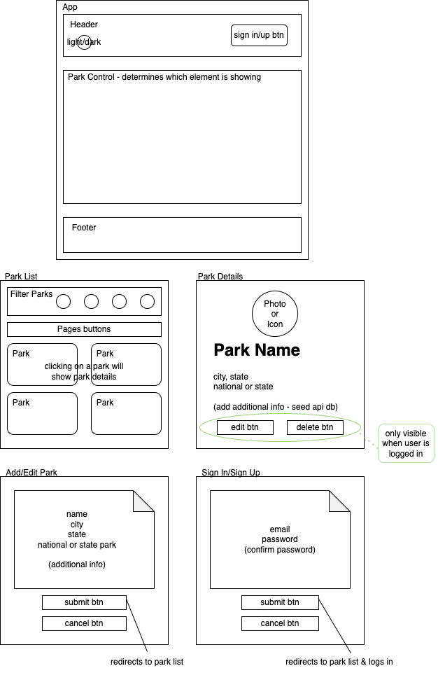
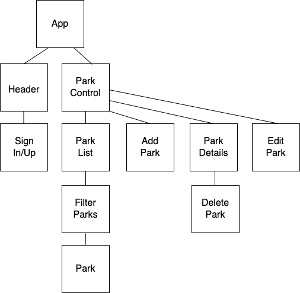

# The Explorer

#### By E. Luckie ☀️

#### This application was made as a front-end that consumes information from [this API](https://github.com/eluckie/ParksApi.Solution.git) about National & State Parks. Users are able to see a list of all parks, as well as add parks, edit, or delete parks. 

## Technologies Used

* React
* JSX
* JavaScript
* HTML
* CSS
* Firebase
* Markdown
* Git

## Description

From the main home page, users are able to see a list of state and national parks. From this page, users may choose to apply filters which automatically update the list, browse the list of parks by clicking to buttons to flip through the pages, or update how many parks are viewable per page (at the bottom of the page). From the main list, users are able to click on any specific park to be taken to that park's details page.

[Click here](https://eluckie.github.io/the-explorer/) to view the live version of this webpage.

### Filters

| Parameter | Type | Description |
| --------- | ----- | ----------- |
| city | text | returns parks with a matching city value |
| state | text | returns parks with a matching state value | 
| state park | radio button | returns parks that are denoted as a state park |
| national park | radio button | returns parks that are denoted as a national park |
| __ per page | drop-down | changes the amount of parks displayed per page |  
| next | button | changes the results display to the next page. if there is no additional pages of your results, the button is not displayed |
| previous | button | changes the results display to the previous page. if you are on the first page, the button is not displayed |

## User Navigation

### When Not Logged In

There are ``sign up`` and ``log in`` buttons along the top of the page.

* ``sign up`` takes the user to a form where they can sign up with an email & password. completing registration automatically signs the user in and redirects to the home page
>NOTE: this is a simple, unverified way of registering as a user
* ``log in`` takes the user to a form where they can sign in with an email & password they've previously registered. signing in automatically redirects user to the home page
* when a user is successfully logged in, their email is showing along the top of the page

### Once Logged In

There are buttons to ``add new park`` and ``log out`` along the top of the page.

* ``log out`` automatically signs you out & updates the user's email at the top of the page to a message stating successful sign out
* ``add new park`` takes the user to a form where they may enter the park's full name, city and state it's located in, as well as denoting if it's a state or national park. 

If adding the new park is successful, user is redirected to the new park's details page. From there they may choose to navigate back to the full park list, or ``edit`` or ``delete`` the current park
* ``edit park`` takes the user to a form where they may enter the park's updated details. If any of the form is left blank, that specific detail is not updated. On edit, user is redirected back to that same park's details page
* ``delete park`` takes the user to a page confirming the park they want to delete. One confirmed, user is redirected back to the main park list (whatever filters they had on before, if any, are not cleared)

## Diagrams

#### Site Diagram

#### Component Diagram

## Setup/Installation Requirements

### To Install and Run The API
1. First, [go here](https://github.com/eluckie/ParksApi.Solution.git) and follow all directions in the README to get the API up and running
2. Once the API is running in either development or production mode, follow the below instructions to install and run this project

### To Install and Run This Project

1. Clone this repository to your desktop
2. Navigate to the top level of this directory called ``the-explorer``
3. Run the code ``npm install`` in your terminal to install the necessary packages and plug-ins
4. Run the code ``npm run start`` in your terminal to start the application and open the project in your web browser

**NOTE:** both the Parks API _and_ this React project must be actively running in order to function properly. If something is not working, revisit the set up instructions for both projects

## Known Bugs

* edit & delete cause an error when trying to click straight from park creation. no issues when navigating to edit or delete from the park list

## Stretch Plans

* Add a light & dark mode
* Add additional info to parks API info - activities, landmarks, etc.
* Host API so that project is accessible at all times

## License

MIT License

Copyright (c) 2023 Luckie

__________

This project was bootstrapped with [Create React App](https://github.com/facebook/create-react-app).